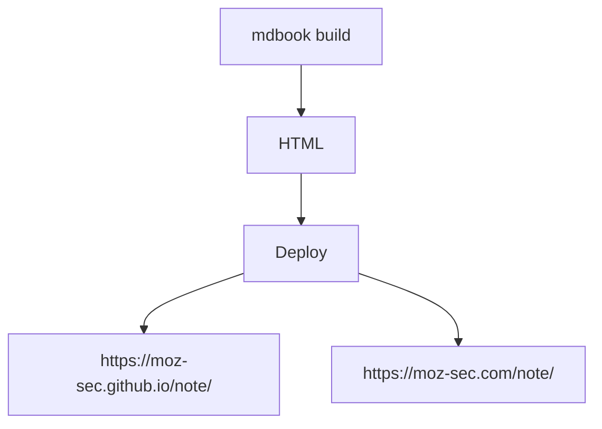

このノートは、Markdown で書いて、Github を使って管理している。
また、リポジトリの情報が書き変わったら、Github Action で自動コンパイルを行い、Github Pages にデプロイして公開している。
コンパイルには、[mdbook](https://github.com/rust-lang/mdBook) というツールを使っている。

ここでは、このノートの環境構築をメモとして残そうと思う。

**リポジトリ: [https://github.com/moz-sec/note](https://github.com/moz-sec/note)**

## 1. Rust のインストール

私は、Rust が既に動くような環境だったため、このステップは飛ばした。
もし、Rust のセットアップがまだの場合は、[公式サイト(rust-lang.org)](https://www.rust-lang.org/tools/install) からインストールできる。

## 2. mdbook のインストール

mdbook のインストールは、Cargo を使って行う。
Cargo は、Rust のビルドシステム兼パッケージマネージャーであり、上記のように公式サイトから Rust をインストールした場合、既に使えるようになっている。

以下のコマンドを実行して、mdbook をインストールする。
これにより、```$ mdbook```でコマンドが使えるようになる。

```bash
cargo install mdbook
```

## 3. mdbook の雛形を作成する

mdbook の雛形を作成するには、以下のコマンドを実行する。

```bash
mdbook init
```

これで、以下のようなディレクトリ構成になる。

```text
|-- book
|-- src
|   |-- SUMMARY.md
|   |-- chapter_1.md
|-- book.toml
```

*src/* の Markdownファイルを編集し、`mdbook build`を実行することで、*book/* に HTMLファイルが生成される。

## 4. Github に リポジトリを作成し、Github Pages を有効化する

Github に リポジトリを作成する。
今回は、[note](https://github.com/moz-sec/note) というリポジトリを作成し、`git push`を実行する。
その後、Github の Settings/Pages の Branch を None から main に変更することで、 Github Pages が有効になる。
同時に、Enforce HTTPS にチェックを入れることで、HTTPS に変更する。
これで、[https://moz-sec.github.io/note/](https://moz-sec.github.io/note/) でアクセスできるようになる。


## 5. ドメインを取得し、設定する

ドメインを取得し、Github の Settings/Pages の Custom domain で取得したドメインを設定する。
これで、[https://moz-sec.github.io/note/](https://moz-sec.github.io/note/) だけでなく [https://moz-sec.com/note/](https://moz-sec.com/note/) でもアクセスできるようになる。


## 6. Github Action を設定する

Github の Settings/Pages の Source で Github Actions を選択する。
この設定により、Github の main ブランチが変更されるたびに、Github Action によって、`mdbook build` が行われ、Github Pages にデプロイされる。
Github Action の workflow は、[.github/workflows/mdbook.yml](https://github.com/moz-sec/note/blob/main/.github/workflows/mdbook.yml) に記述してある。



